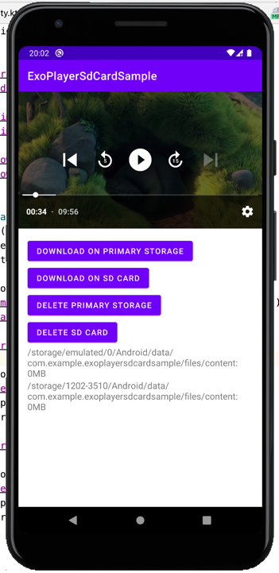

# ExoPlayer sd-card download sample
This is a sample app demonstrating downloading content to sd-card with ExoPlayer.
)

Player firstly checks primary storage cache, then looks to sd-card and then goes online to get the content.

